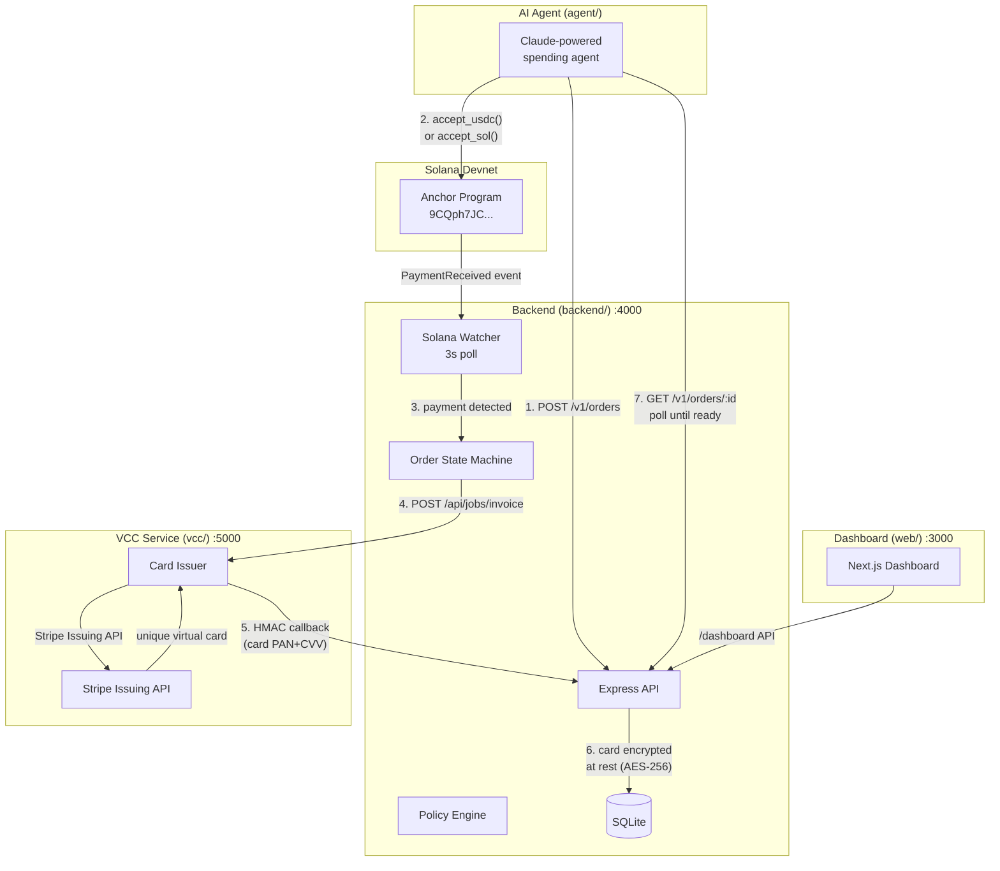
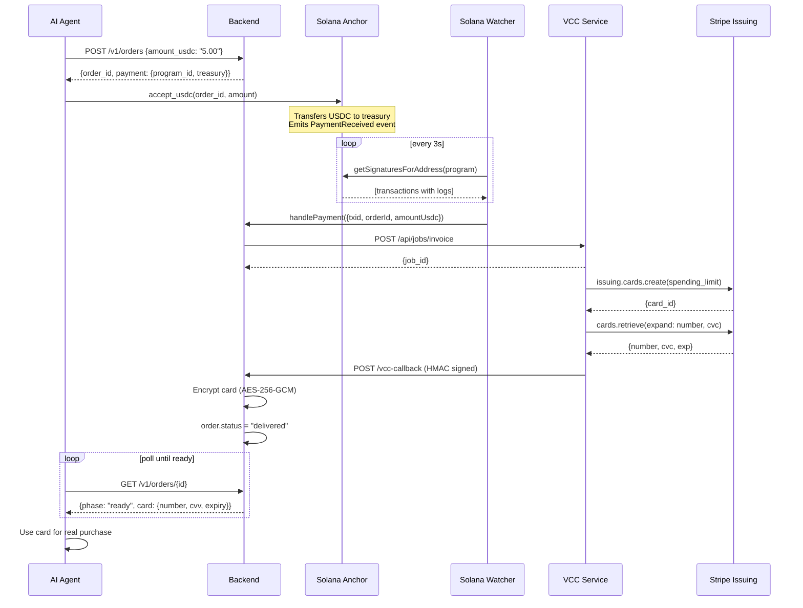
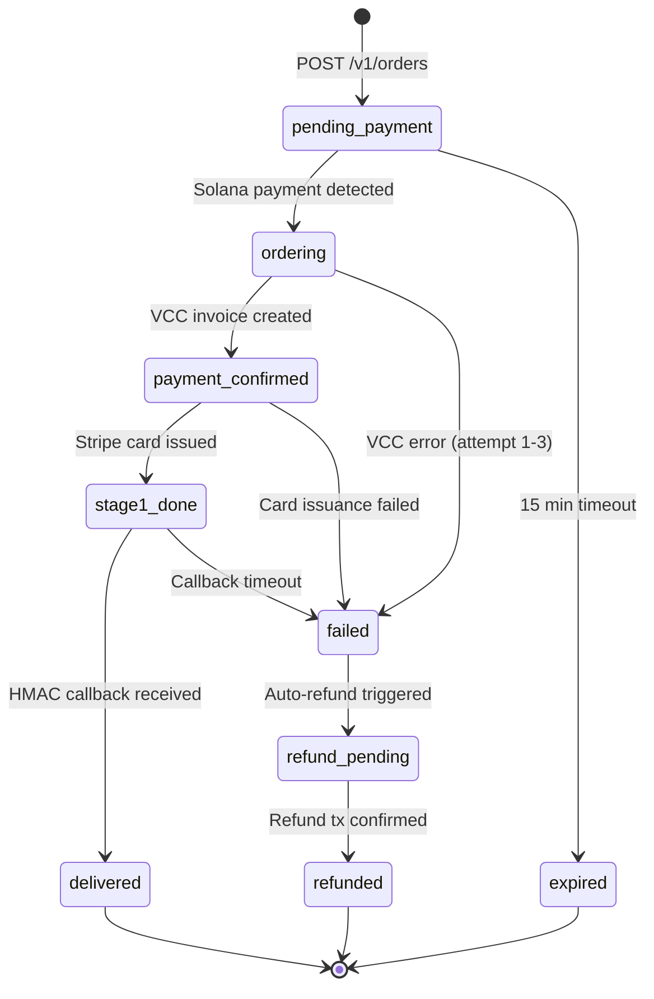
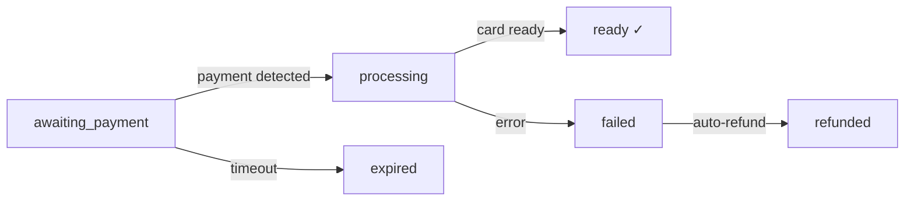

# Obolus

AI agent treasury for Solana. Agents pay USDC or SOL on-chain and receive a real virtual Visa card within seconds — every transaction verifiable on-chain, every card spend visible to token holders.

[](LICENSE)
[](https://explorer.solana.com/address/9CQph7JCyba9uWBRGoDmpiGSnZn2gtvqLBTMF7CYKJzK?cluster=devnet)

---

## Overview

Obolus lets an AI agent autonomously spend a budget — buying cloud credits, API subscriptions, or any online service — using a virtual Visa card funded directly from its Solana wallet. No human in the loop for every purchase, no custodian holding the funds.

```
Creator funds project → Agent wallet holds USDC/SOL
Agent decides to spend → Pays Solana Anchor program
Obolus detects payment → Issues virtual Visa card
Agent uses card → Makes real online purchase
Token holders see everything → On-chain tx + dashboard feed
```

---

## Architecture

### System Components



### End-to-End Payment Flow



### Order State Machine



---

## Repository Structure

```
obolus/
├── contract/          Solana Anchor program (Rust)
│   ├── programs/obolus/src/lib.rs   accept_usdc, accept_sol instructions
│   └── Anchor.toml                  Program ID, provider config
│
├── backend/           Node.js API server
│   ├── src/
│   │   ├── index.js               Entry point, watcher + jobs startup
│   │   ├── app.js                 Express app, routes, middleware
│   │   ├── db.js                  SQLite schema + 16 migrations
│   │   ├── payment-handler.js     Payment → VCC pipeline
│   │   ├── fulfillment.js         Order fulfillment state machine
│   │   ├── policy.js              Spend limits, approval gating
│   │   ├── jobs.js                Background reconcilers
│   │   ├── vcc-client.js          VCC service HTTP client
│   │   ├── api/
│   │   │   ├── orders.js          POST/GET /v1/orders
│   │   │   ├── dashboard.js       Operator dashboard API
│   │   │   ├── platform.js        Cross-tenant platform API
│   │   │   ├── auth.js            Email OTP login
│   │   │   └── vcc-callback.js    HMAC-verified card delivery
│   │   ├── payments/
│   │   │   ├── solana.js          Solana watcher (3s poll)
│   │   │   ├── solana-sender.js   USDC/SOL refund sender
│   │   │   └── sol-price.js       SOL/USD oracle (CoinGecko)
│   │   └── lib/
│   │       ├── secret-box.js      AES-256-GCM card encryption
│   │       ├── hmac.js            VCC callback signature verify
│   │       ├── event-bus.js       In-process SSE fanout
│   │       └── email.js           OTP email delivery (nodemailer)
│   └── test/                      Unit + integration tests
│
├── vcc/               Virtual card service
│   └── src/index.js               Stripe Issuing API integration
│                                  (unique card per order, spending limit)
│
├── sdk/               TypeScript SDK (npm: obolus)
│   └── src/
│       ├── client.ts              ObolusClient — createOrder, waitForCard
│       ├── mcp.ts                 MCP server for Claude Desktop
│       ├── cli.ts                 npx obolus CLI
│       └── ows.ts                 OWS wallet integration
│
├── web/               Next.js dashboard
│   └── app/
│       ├── dashboard/             Operator views (agents, orders, analytics)
│       └── api/                   BFF routes (admin-proxy, auth)
│
├── agent/             Claude-powered AI agent example
└── demo/              Demo merchant (test Stripe checkout)
```

---

## Solana Contract

**Program ID (devnet):** `9CQph7JCyba9uWBRGoDmpiGSnZn2gtvqLBTMF7CYKJzK`

Two instructions:

```rust
// Pay USDC for a card order
pub fn accept_usdc(ctx: Context<AcceptUsdc>, order_id: [u8; 32], amount: u64) -> Result<()>

// Pay SOL for a card order
pub fn accept_sol(ctx: Context<AcceptSol>, order_id: [u8; 32], amount: u64) -> Result<()>
```

Both emit `PaymentReceived { order_id, payer, amount, asset }` which the Solana watcher picks up via `getSignaturesForAddress`.

---

## Quick Start

### Prerequisites

- Node.js 20+
- Rust + Anchor CLI (for contract changes only)
- Stripe account (free, test mode) with Issuing enabled

### 1. Backend

```bash
cd backend
cp .env.example .env
# Fill in: SOLANA_TREASURY_SECRET, VCC_CALLBACK_SECRET, OBOLUS_SECRET_BOX_KEY, OWNER_EMAIL

npm install
node --env-file=.env src/index.js
# → Backend running on :4000
# → Solana watcher polling devnet every 3s
```

### 2. VCC Service

```bash
cd vcc
cp .env.example .env
# Fill in: STRIPE_SECRET_KEY=sk_test_...
# Enable Issuing at: dashboard.stripe.com/test/issuing/overview

node --env-file=.env src/index.js
# → VCC running on :5000
# → mode: stripe_issuing (unique card per order)
```

### 3. Dashboard

```bash
# Root of repo
npm install
npm run dev
# → Dashboard running on :3000
```

### 4. End-to-End Test

```bash
cd backend
node --env-file=.env test-solana-e2e.js
# Uses /dev/simulate-payment — no real USDC needed
```

Expected output:
```
 Obolus Solana E2E Test — $1.00 USDC
──────────────────────────────────────
 KART TESLİM EDİLDİ
 Numara : ************0013
 Expiry : 01/29
 Brand  : USD Visa Card
 Ödeme → Kart : 2.2s
```

---

## Environment Variables

### Backend (`backend/.env`)

| Variable | Required | Description |
|---|---|---|
| `SOLANA_TREASURY_SECRET` | ✅ | Treasury wallet base58 secret key |
| `SOLANA_PROGRAM_ID` | ✅ | Anchor program ID |
| `SOLANA_USDC_MINT` | ✅ | USDC mint address (devnet default set) |
| `VCC_CALLBACK_SECRET` | ✅ | HMAC secret for VCC callbacks — `openssl rand -hex 32` |
| `OBOLUS_SECRET_BOX_KEY` | ✅ prod | AES-256-GCM key for card encryption — `openssl rand -hex 32` |
| `OWNER_EMAIL` | ✅ | First user gets owner role |
| `CORS_ORIGINS` | ✅ | Allowed origins e.g. `http://localhost:3000` |
| `VCC_API_BASE` | ✅ | VCC service URL e.g. `http://localhost:5000` |
| `SMTP_HOST/USER/PASS/FROM` | optional | Email OTP (dev: code printed to console) |
| `SOLANA_NETWORK` | optional | `devnet` (default) or `mainnet-beta` |

### VCC Service (`vcc/.env`)

| Variable | Required | Description |
|---|---|---|
| `STRIPE_SECRET_KEY` | optional | `sk_test_...` — enables Stripe Issuing. Without it, uses hardcoded test cards |
| `BACKEND_URL` | optional | Backend URL for registration — default `http://localhost:4000` |

---

## API Reference

### Agent API (`/v1/*`) — requires `X-Api-Key`

```
POST /v1/orders
  Body: { amount_usdc: "5.00", webhook_url?, metadata? }
  → { order_id, payment: { program_id, treasury, usdc: { amount } } }

GET  /v1/orders/:id
  → { status, phase, card?: { number, cvv, expiry, brand } }

POST /v1/agent/status
  Body: { state, wallet_public_key?, detail? }
  → { ok: true }

GET  /v1/usage
  → { budget, orders: { total, delivered, failed, ... } }

GET  /v1/policy/check?amount=X
  → { allowed, rule?, reason? }
```

### Order Phases (agent-visible)



### Health

```
GET /status
  → { ok, solana_watcher: { last_signature, age_seconds, stalled }, ... }

GET /api/version
  → { service, version, hmac_protocol, features }
```

---

## Security

| Feature | Implementation |
|---|---|
| Card data at rest | AES-256-GCM (`OBOLUS_SECRET_BOX_KEY`) |
| VCC callbacks | HMAC-SHA256 v3 with per-order nonce |
| API keys | bcrypt hashed, prefix fast-path |
| Claim codes | One-time, SHA256 stored, 10-min TTL |
| Auth | Email OTP + session tokens |
| Rate limiting | Per-IP and per-key on all endpoints |
| CORS | Strict allowlist, validated at boot |
| HTTPS | Enforced in production (426 on plaintext) |
| Wallet validation | Solana base58 `PublicKey` verified at write |

---

## Development

```bash
# Lint + format
npm run lint
npm run format

# Type check
npm run typecheck

# Tests
cd backend && npm test

# Simulate a Solana payment without real USDC (dev only)
curl -X POST http://localhost:4000/dev/simulate-payment/<order-id>
```

---

## Roadmap

See [docs/feature-backlog.md](docs/feature-backlog.md) for the full list. Highlights:

- **Python SDK** — most agent frameworks (CrewAI, LangGraph, autogen) run on Python
- **Reloadable cards** — persistent card for subscription-style spending
- **Multi-agent budget sharing** — parent/child spend envelopes
- **EVM chain support** — USDC on Base/Arbitrum as alternative rail
- **SOC 2 Type I** — table stakes for enterprise adoption

---

## Contributing

```bash
git clone https://github.com/enliven/obolus
cd obolus
npm install
```

Commits follow [Conventional Commits](https://www.conventionalcommits.org/). Pre-commit hooks run lint + format.

---

## License

MIT © [enliven](https://github.com/enliven)
